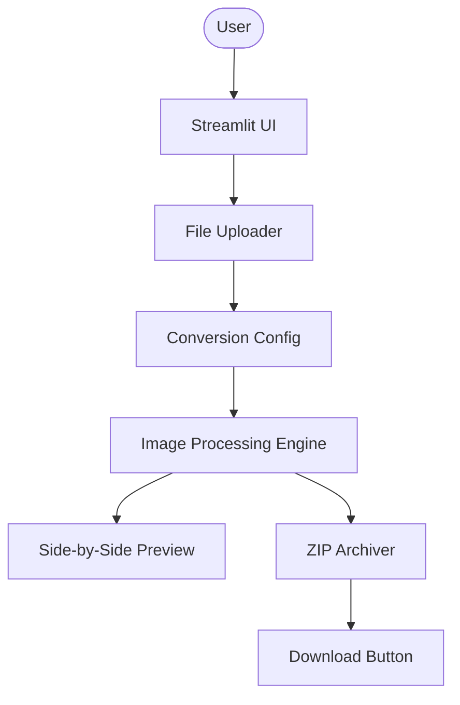

# Architecture: Streamlit Image Converter (JPEG to WebP)

This document outlines the architectural design and data flow of the Streamlit Image Converter.

## System Overview

The application is a single-page Streamlit web tool that processes images entirely in-memory to ensure privacy and speed.



*(ASCII Representation)*
```text
+----------+      +----------------+      +----------------------+
|   User   | ---> |  Streamlit UI  | ---> | Image Processing Lib |
+----------+      +-------+--------+      +----------+-----------+
                          |                          |
               +----------v----------+      +--------v---------+
               |  In-Memory Storage  | <--- |  WebP Conversion  |
               | (BytesIO / Session) |      |   (Pillow/PIL)   |
               +----------+----------+      +--------+---------+
                          |                          |
               +----------v----------+      +--------v---------+
               |    ZIP Archiver     | <--- |   Result Preview  |
               | (zipfile / BytesIO) |      | (Image Comparison)|
               +----------+----------+      +------------------+
                          |
               +----------v----------+
               |  Download Trigger   |
               +---------------------+
```

## Component Responsibilities

| Component | Responsibility |
| :--- | :--- |
| **Streamlit UI** | Handles user interactions, file uploads, configuration sliders, and displaying results. |
| **Image Processing Engine** | Uses Pillow to open JPEGs, apply resizing, and encode as WebP (Lossy/Lossless). |
| **Preview Logic** | Generates side-by-side comparisons using `streamlit-image-comparison` or standard columns. |
| **Archiving Service** | Aggregates all converted buffers into a single ZIP file using the `zipfile` module. |
| **State Management** | Uses `st.session_state` to persist uploaded files and conversion settings across reruns. |

## Recommended Project Structure

```text
/
├── .planning/            # Design and research documentation
├── src/
│   ├── app.py            # Main Streamlit entry point
│   ├── processor.py      # Core image conversion logic (Pillow)
│   ├── utils.py          # Helper functions (ZIP creation, formatting)
│   └── ui_components.py  # Custom UI elements and layout helpers
├── tests/
│   ├── test_processor.py # Unit tests for image logic
│   └── conftest.py       # Test configuration and fixtures
├── assets/               # Static assets (logo, etc.)
├── requirements.txt      # Project dependencies
└── README.md             # Usage instructions
```

## Data Flow

1.  **Upload**: User selects one or more JPEG files via `st.file_uploader`. Files are held in memory as `UploadedFile` objects.
2.  **Preview/Config**:
    *   The UI displays a preview of the first image.
    *   User adjusts quality (0-100), toggles Lossless mode, or sets new dimensions.
    *   Settings are captured via `st.sidebar` or main area widgets.
3.  **Conversion**:
    *   On "Convert" trigger, the `processor.py` iterates through all files.
    *   Each JPEG is read into a Pillow `Image` object.
    *   Adjustments (resize) are applied.
    *   Image is saved to an `io.BytesIO` buffer in `WEBP` format.
4.  **ZIP/Download**:
    *   All converted buffers are added to a `zipfile.ZipFile` object (also in-memory).
    *   The final ZIP buffer is served to the user via `st.download_button`.
